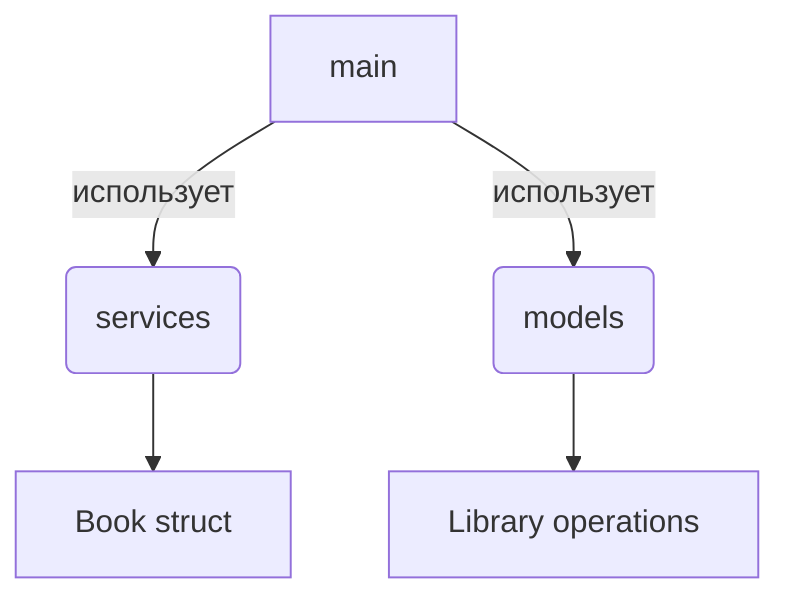

# Library Manager CLI

Мой второй микро-проект на Go в процессе изучения языка. Консольный менеджер библиотеки книг с использованием структур и пакетов.

## 🧠 Контекст

Как начинающий Go-разработчик, я создаю этот проект чтобы:
- Закрепить основы синтаксиса Go
- Освоить работу со структурами
- Понять организацию кода в пакеты
- Научиться обработке ошибок
- Разработать полноценное CLI-приложение

Несмотря на простоту функционала, проект включает ключевые аспекты реальной разработки.

## 🛠 Функционал

### Основные возможности
- ✅ Добавление новых книг в библиотеку
- 📋 Просмотр списка всех книг
- 🗑️ Удаление книг по ID
- 🧹 Очистка всей библиотеки
- 🔍 Бинарный поиск для удаления

### Технические особенности


## 📦 Структура проекта

```
lib/
├── models/
│   └── models.go         # Структуры данных и переменные
├── services/
│   └── services.go       # Бизнес-логика библиотеки
├── main.go               # Точка входа и интерфейс
├── go.mod                # Зависимости
└── README.md             # Документация
```

## 🚀 Запуск

1. Установите Go (версия 1.18+)
2. Клонируйте репозиторий:
   ```bash
   git clone https://github.com/dobromilov/lib.git
   ```
3. Перейдите в директорию проекта:
   ```bash
   cd lib
   ```
4. Соберите и запустите:
   ```bash
   go run main.go
   ```

## 🔍 Что я освоил в этом проекте

### Основные концепции
- Работа со структурами (struct Book)
- Организация кода в пакеты (models, services)
- Обработка ошибок

### Продвинутые темы
- Работа с пользовательским вводом (bufio)
- Бинарный поиск в массивах
- Работа со срезами (append, удаление элементов)
- Декомпозиция приложения на модули

### Алгоритмы
- Бинарный поиск для быстрого удаления
- Форматированный вывод таблиц
- Управление состоянием приложения

## 🤝 Как я учусь

Этот проект — часть моего пути изучения Go. Я осознанно:
- Начинаю с простых концепций
- Постепенно усложняю архитектуру
- Анализирую ошибки
- Регулярно рефакторю код

Сейчас мой фокус — на качестве кода, а не только на функционале.

# tg: dobro_milka
