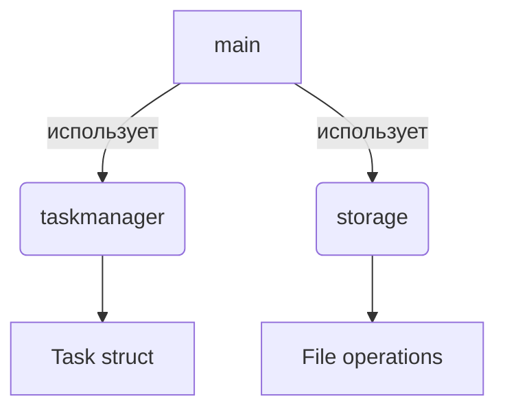

# Task Manager CLI

Мой первый микро-проект на Go в процессе изучения языка. Консольный менеджер задач с сохранением состояния между запусками.

## 🧠 Контекст

Как начинающий Go-разработчик, я создаю этот проект чтобы:
- Закрепить основы синтаксиса Go
- Освоить работу с файловой системой
- Понять организацию кода в пакеты
- Научиться обработке ошибок
- Разработать полноценное CLI-приложение

Несмотря на простоту функционала, проект включает ключевые аспекты реальной разработки.

## 🛠 Функционал

### Основные возможности
- ✅ Добавление новых задач
- 📋 Просмотр списка всех задач
- ✔️ Отметка задач как выполненных
- 💾 Автосохранение при выходе
- 🔄 Загрузка предыдущего состояния

### Технические особенности


## 📦 Структура проекта

```
taskmanager/
├── internal/
│   ├── taskmanager/
│   │   └── task.go        # Логика работы с задачами
│   └── storage/
│       └── storage.go     # Работа с файлами
├── main.go                # Точка входа и интерфейс
└── go.mod                 # Зависимости
```

## 🚀 Запуск

1. Установите Go (версия 1.18+)
2. Клонируйте репозиторий:
   ```bash
   git clone https://github.com/Dobromilov/taskmanager.git
   ```
3. Перейдите в директорию проекта:
   ```bash
   cd taskmanager
   ```
4. Соберите и запустите:
   ```bash
   go run main.go
   ```

## 🔍 Что я освоил в этом проекте

### Основные концепции
- Работа со срезами и структурами
- Указатели и передача по ссылке
- Организация кода в пакеты
- Обработка ошибок

### Продвинутые темы
- Работа с файлами (os, bufio)
- Чтение пользовательского ввода
- Декомпозиция приложения
- Сохранение состояния

## 📈 Следующие шаги в развитии

Планирую улучшить проект добавлением:
- [ ] Категорий задач
- [ ] Поиска по задачам
- [ ] Цветного вывода
- [ ] Конфигурационного файла

## 🤝 Как я учусь

Этот проект — часть моего пути изучения Go. Я осознанно:
- Начинаю с простых концепций
- Постепенно усложняю архитектуру
- Анализирую ошибки
- Регулярно рефакторю код

Сейчас мой фокус — на качестве кода, а не только на функционале.

[](t.me/dobro_milka)
